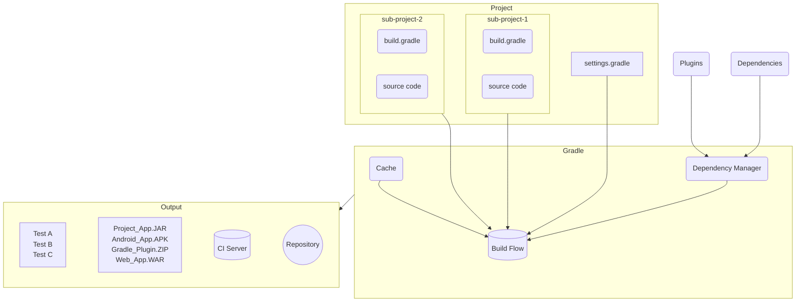

# Gradle Basics

Gradle automates building, testing and deployment using build scripts.


## Gradle core concepts

### Projects

A Gradle project is a piece of software that can be built, such as an application or a library.  
**Single project** builds include a single project called the **root project**.  
**Multi-project** builds include one **root project** and any number of **subprojects**.

### Build Scripts

**Build scripts** steps, which Gradle should do to build the project.  
Project can have one or more build scripts.

### Dependency Management

**Dependency management** is an automation, which helps declaring and resolving external resources required by a project.  
Typical project includes a number of external dependencies that Gradle will resolve during the build.

### Tasks

**Tasks are a basic unit of work** like compiling or running tests.  
Project contains one or more tasks defined in a build script or a plugin.

### Plugins

Plugins are **extensions of Gradle capabilities**. Optionally contribute **tasks** to a project.

## Gradle project structure

A typical Gradle project will look like:
```
project
├── gradle                             (1)
│   ├── libs.versions.toml             (2) 
│   └── wrapper
│       ├── gradle-wrapper.jar
│       └── gradle-wrapper.properties
├── gradlew                            (3) 
├── gradlew.bat                        (3) 
├── settings.gradle(.kts)              (4) 
├── subproject-a
│   ├── build.gradle(.kts)             (5) 
│   └── src                            (6) 
└── subproject-b
    ├── build.gradle(.kts)             (5) 
    └── src                            (6) 
```

(1) Directory to store wrapper file and more  
(2) Version catalog for dependency management  
(3) Wrapper scripts  
(4) Settings file to define a root project name and subprojects  
(5) Build scripts of the two subprojects  
(6) Source code and additional project's files

## Invoking Gradle

### IDE

Gradle is build-in to many IDEs including IntelliJ IDEA, Eclipse and NetBeans.
It can be automatically invoked during the build, or application run in the IDE.

### Command line

Can be invoked in the command line once installed. For example:
```bash
$ gradle build
```

:::note

Most project do not use the installed version of Gradle.

:::

### Gradle wrapper

The Wrapper is a script that invokes declared version of Gradle.
It is **the recommended way to execute a Gradle build**.
It can be found in the project root directory as a `gradlew` or `gradlew.bat` file:
```bash
$ gradlew build     // Linux or OSX
$ gradlew.bat build // Windows
```

