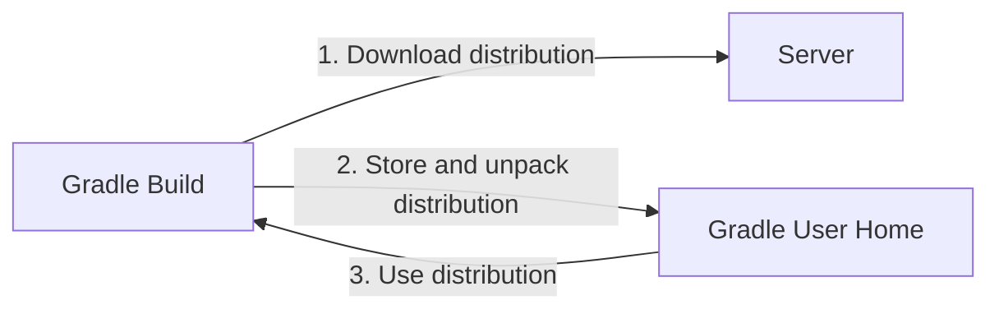

# Gradle Wrapper Basics

Gradle wrapper is the recommended way to execute Gradle build.
The Wrapper script downloads a declared version of Gradle if necessary and execute it.


The Wrapper is available as a `gradlew` or `gradlew.bat` file and provides the following benefits:
- Standardizes a project on a given Gradle version.
- Provisions the same Gradle version for different users.
- Provisions the same Gradle version for different execution environments.

## Using the Gradle Wrapper

It is always recommended to execute a build with the Wrapper.
Depending on the operation system, you use `gradlew` or `gradlew.bat` script.
Gradle invocation:
```bash
$ gradle build
```

To run the Wrapper:
```bash
$ ./gradlew build     # Linux or OSX
$ .\gradlew.bat build # Windows
```

Demo of using the Wrapper on a Linux machine for a Java-based project:
```bash
./gradlew build
Downloading https://services.gradle.org/distributions/gradle-8.2.1-bin.zip
............10%............20%............30%.............40%............50%............60%............70%.............80%............90%............100%

BUILD SUCCESSFUL in 26s
7 actionable tasks: 7 executed
```
