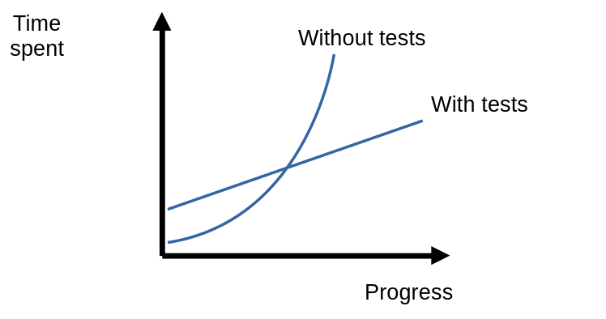

---
tags:
    - development
    - testing
    - java
    - unit testing
---

# Unit Testing

## Unit Testing Goals

It is belived that unit-testing improves quality of the code in your project.
But this is not the main goal of unit-testing, this is only the positive side-effect.
The main goal of unit-testing is support the stable growth of software project.
The key word here is **stable**.
The following figure displays growth dynamic of typical projects without tests and with tests.

Without tests development start fast.
But as the time goes on, you have to spent more and more time to implement the same functional as at the beginning of the project.
Develomplent speed reducing is called **software entropy**.
In the software projects ent

